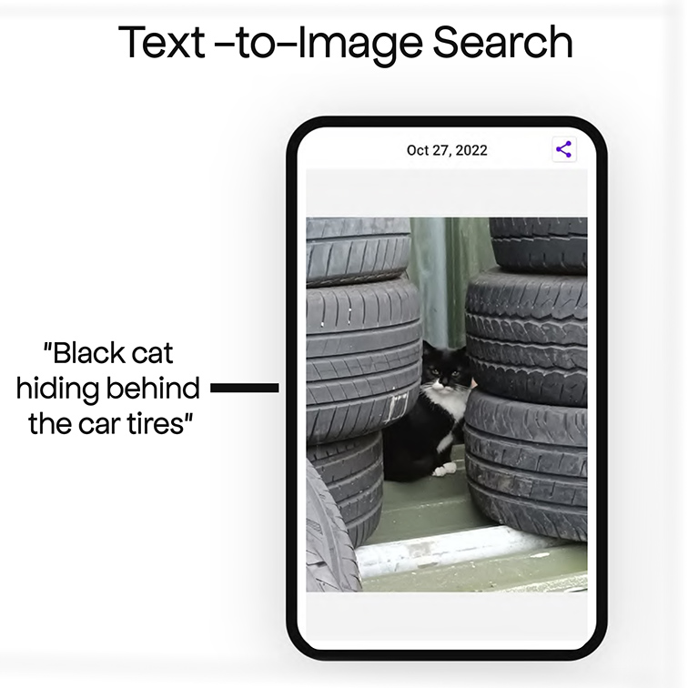
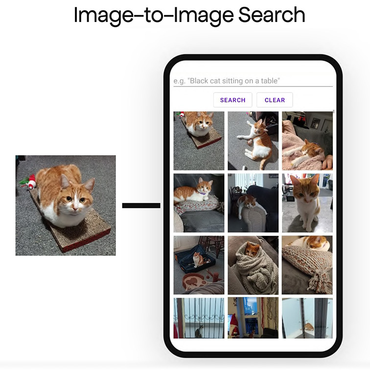

# TIDY - Text-to-Image Discovery

Offline Text-to-Image and Image-to-Image search on your phone powered by the state-of-the-art large-scale vision-language pretrained CLIP model!  

## Approach
TIDY uses OpenAI CLIP (Contrastive Language-Image Pre-Training) model - a neural network trained on a variety of vision-language pairs. CLIP efficiently learns visual concepts from natural language supervision, which allows TIDY to use it for Text-to-Image retrieval. CLIP can also be used to get high-quality image representations with high universality and generalization ability providing great results in the Image-to-Image retrieval task.

The model used in TIDY is based on open source CLIP implementation [OpenCLIP](https://github.com/mlfoundations/open_clip) pretrained on [LAION-2B](https://huggingface.co/datasets/laion/laion2B-en), a ~2B sample subset of [LAION-5B](https://laion.ai/blog/laion-5b/) dataset with english captions.
|  |
|:--:|
| Image Credit: https://github.com/openai/CLIP |

## Features and Usage
During the first launch TIDY will need to scan through your photo library and create an index of your images. This indexing process may take some time, but it's a one-time event. Once this initial indexing process is complete, the app will store the index on your device, and any new photos you add to your photo library will be automatically added to the index on the subsequent app launches. it also means that you can use it anytime, anywhere, even in areas with poor or no internet connectivity.

TIDY works entirely offline, ensuring your privacy and security are never compromised. None of your data or images are ever uploaded to a remote server or shared with third parties, ensuring your personal information stays safe and secure.  It also means that you can use it anytime, anywhere, even in areas with poor or no internet connectivity.

### Text-to-Image Search
Simply type in a description of the image you are looking for, and TIDY will retrieve the most relevant matches from your local image library. Text-to-Image search functionality in TIDY goes beyond traditional keyword-based searches! You can use longer and more detailed descriptions to find the exact image you have in mind.
### Image-to-Image Search
Search for visually similar images by choosing a photo from your device's gallery. TIDY will analyze the image and retrieve images with similar visual features, allowing you to explore and discover new images in a whole new way.
